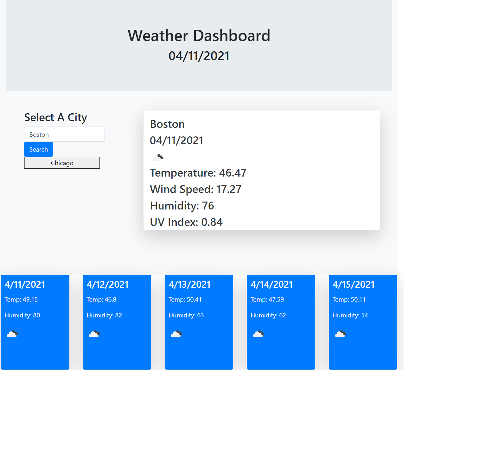

# 06-Weather-Dashboard
## Description
The task of this project was to create a simple weather dashboard that would display the specific time, temperature, wind speed, humidity, and uv index of the user's desired city.  Also displayed is the 5 day forecast of the selected city including temperature, humidity, and an icon describing upcoming weather conditions.  Weather data was acalled from the Open Weather API and current time was calculated by Moment JS. 

**Links**

* [Deployed Webpage](https://danringenbach.github.io/06-Weather-Dashboard/ "Deployed Webpage")
* [Repository Link](https://github.com/DanRingenbach/06-Weather-Dashboard "Repository Link")

**Screenshot**
 
 
 
 
